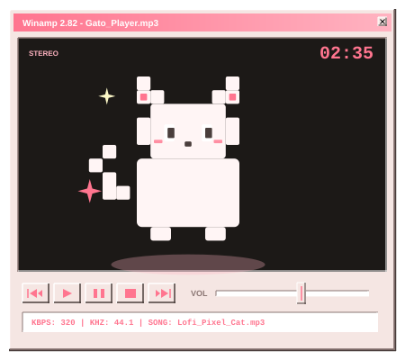
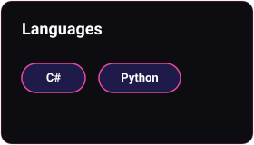
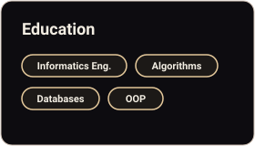
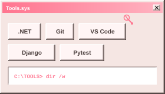

<!-- CABECERA Y NAVEGACIÓN -->
<table border="0" width="100%" cellpadding="0" cellspacing="0">
  <tr>
    <td align="right" valign="middle">
      

        <a href="#sobre-mi" style="color: #e6ca9c; text-decoration: none; font-weight: bold;">Sobre Mí</a> &nbsp;&nbsp;&nbsp;&nbsp;
        <a href="#habilidades" style="color: #a39e93; text-decoration: none; font-weight: bold;">Habilidades</a> &nbsp;&nbsp;&nbsp;&nbsp;
        <a href="#experiencia" style="color: #a39e93; text-decoration: none; font-weight: bold;">Experiencia</a> &nbsp;&nbsp;&nbsp;&nbsp;
        <a href="#contacto" style="color: #a39e93; text-decoration: none; font-weight: bold;">Contacto</a>
      

    </td>
  </tr>
</table>

<!-- SECCIÓN: SOBRE MÍ -->

<table border="0" width="100%" cellpadding="0" cellspacing="0">
  <tr>
    <td width="55%" valign="top" style="padding-right: 20px;">
      <h2 style="color: #f3eee3; font-family: 'Segoe UI', sans-serif; font-size: 32px; margin-top: 0; margin-bottom: 15px;">Sobre Mí</h2>
      

        ¡Hola! 👋 Soy Jimena, estudiante de la <b>Carrera de Informática</b>. Me interesa el desarrollo de software y resolver problemas lógicos para dar vida a las ideas a través de la programación.
      

      

        Mi enfoque académico y profesional está centrado en el desarrollo de software robusto usando <b>C#</b> y la automatización y análisis con <b>Python</b>. Siempre estoy buscando aprender nuevas tecnologías y metodologías que me permitan crecer como profesional.
      

      

        ✨ ¡Actualmente buscando oportunidades de colaboración y proyectos interesantes!
      

    </td>
    <td width="45%" align="center" valign="middle">
      <!-- Animación pixel art del gato en beige y negro -->
      
    </td>
  </tr>
</table>

  

<!-- SECCIÓN: HABILIDADES -->

<h2 style="color: #f3eee3; font-family: 'Segoe UI', sans-serif; font-size: 28px; margin-bottom: 25px;">Habilidades &amp; Tecnologías</h2>

<table border="0" width="100%" cellpadding="0" cellspacing="0">
  <tr>
    <td width="32%" align="center" valign="top">
      
    </td>
    <td width="2%"></td>
    <td width="32%" align="center" valign="top">
      
    </td>
    <td width="2%"></td>
    <td width="32%" align="center" valign="top">
      
    </td>
  </tr>
</table>

  

<!-- SECCIÓN: EXPERIENCIA -->

<h2 style="color: #f3eee3; font-family: 'Segoe UI', sans-serif; font-size: 28px; margin-bottom: 25px;">Experiencia &amp; Proyectos</h2>

<table border="0" width="100%" cellpadding="0" cellspacing="0">
  <!-- Fila 1: 2026 -->
  <tr>
    <td width="60" align="center" valign="top" style="padding-top: 5px;">
       
      
    </td>
    <td valign="top" style="padding-left: 20px; padding-bottom: 30px;">
      <h3 style="color: #f3eee3; font-family: 'Segoe UI', sans-serif; font-size: 18px; margin: 0 0 5px 0;">Estudiante de Informática / Desarrollador Autónomo</h3>
      
Universidad de Informática

      

        Especialización en materias de Algoritmos, Estructuras de Datos y Programación Orientada a Objetos. Creación de proyectos personales utilizando C# para aplicaciones de escritorio.
      

    </td>
  </tr>
  <!-- Fila 2: 2025 -->
  <tr>
    <td width="60" align="center" valign="top" style="padding-top: 5px;">
      
    </td>
    <td valign="top" style="padding-left: 20px; padding-bottom: 20px;">
      <h3 style="color: #f3eee3; font-family: 'Segoe UI', sans-serif; font-size: 18px; margin: 0 0 5px 0;">Primeros Pasos en Programación</h3>
      
Proyectos de Aprendizaje

      

        Inicio del trayecto académico en Informática. Desarrollo de la lógica de programación mediante la resolución de problemas básicos en C# y la creación de pequeños scrapers y utilidades en Python.
      

    </td>
  </tr>
</table>

  

<!-- SECCIÓN: CONTACTO -->

<table border="0" width="100%" cellpadding="0" cellspacing="0">
  <tr>
    <td align="center">
      <h3 style="color: #f3eee3; font-family: 'Segoe UI', sans-serif; font-size: 20px; margin-top: 0; margin-bottom: 15px;">¡Hablemos! 💬</h3>
      

        Si quieres colaborar en algún proyecto, tienes preguntas o solo quieres decir hola, ¡no dudes en contactarme!
      

      

        
        &nbsp;&nbsp;
        
        &nbsp;&nbsp;
        
      

    </td>
  </tr>
</table>
